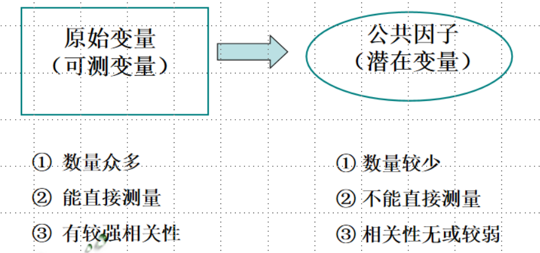

<h1>
因子分析
</h1>
# 一、概述

相关知识
多元线性回归分析、聚类分析、判别分析、主成分分析的共同点是研究可测变量（observed variable）之间的相互关系。

## 1.1 因子(factor)

在医学科学研究中，很多情况下我们所要研究的变量是不能或不易直接测量得到的

变量间较大相关系数的存在表明这些变量可能测量的是相同潜在维度的成分。这些潜在维度被称为因子（或潜变量（latent variable））。因子分析将数据集从一组相互关联的变量减少成较小的一组因子，通过使用最小数量的解释性结构来解释相关矩阵中的最大共同方差来实现简化。

## 1.2 因子分析（factor analyse）

因子分析（factor analysis）最早是20世纪初Charles Spearman在研究儿童智商与家庭、社会、学校环境的关系时提出的一种多元统计分析方法。随着高速计算机的出现扩展到包括心理测量学在内的各个领域，如社会学、医学、地矿测量、生命质量评价等等。

因子分析：是从多个可测变量的相关关系入手，寻找隐藏在可测变量中，无法直接观察到，却影响或支配可测变量的潜在因子，并估计潜在因子对可测变量的影响程度以及潜在因子之间的关联性的一种多元统计分析方法。是一种数据降维技术。

因子分析的实质：用少数几个潜在的不能直接测量的变量去描述许多可测变量间的协方差结构。

  

因子分析的主要假设是这些因子代表了现实存在的维度，必须通过考察哪些变量在同一因子上有较高的载荷（loading）来猜测它们的性质。因此，心理学家可能认为，因子代表心理层面，教育研究人员可能认为它们代表能力，而社会学家可能认为它们代表种族或社会阶层。然而，这一假设是否站得住脚是一个极具争议的观点，一些人认为，因子分析得出的维度仅在统计意义上是真实的，是真实世界的虚构，其可能并不存在一个潜在的底物。

因子分析的目的：主要目的之一就是简化原始变量的维数，使因素结构简单化，希望以最少的共同因素（公共因子），能对原始变量的总变异量作最大解释，因此抽取的因子越少越好，但抽取因子的累积解释变异量越大越好 。

这里先讲一下探索性因子分析。其实在病理学和人格研究中，很多量表的验证性因子分析结果都不理想（你很难跑出原作者的理想数据拟合结果），这跟临床量表的心理测量属性有关。所以很多量表的修订都是通过探索性因子分析来进行的。

## 1.3 因子载荷/负荷 （factor loading）：

可以被认为是一个因子和一个变量之间的皮尔逊相关，从我们所知道的相关系数的解释应该可以知道，如果我们把因子载荷/负荷 平方，就可以得到一个特定变量对因子的实质性重要性的度量（其实就类似于R方所说明的）。

我们可以用下面的公式来表示因子：
$Factor_i = b_1 * var_{1i} + b_2 * var_{2i} + ... + b_n * var_{ni} + ε_i$

公式中的b值是我们得到每个变量与因子计算得到的相关系数，即因子载荷/负荷。

  

  

## 1.4 因子得分（factor scores）

一个因子可以用所测量的变量及其对该因子的相对重要性(用b的值表示)来描述。因此，在发现了存在哪些因子并估计了描述它们的方程之后，还应该可以根据构成变量的得分来估计一个人在某个因子上的得分。这些分数被称为因子分数。最简单的求因子得分的方法是带入我们通过计算每个自变量相对于因子的距离（即b值，也就是因子载荷）得到的对因子的表达的线性方程（带入1.3部分的公式）。

因子评分有几个用途。首先，如果因子分析的目的是将大量的数据减少到测量变量的一个更小的子集中，那么因子得分告诉我们一个人在这个子集中的得分。因此，任何进一步的分析都可以在因子得分上进行，而不是在原始数据上。例如，我们可以进行t检验，看看女性是否明显比男性更善于社交。第二个用途是克服共线性问题的回归。如果在多元回归分析之后，我们已经确定了多重共线性的来源，那么分析的解释就会受到质疑。在这种情况下，我们可以对预测变量进行主成分分析，将其简化为几个主成分。引起多重共线性的变量将组合成一个因子。如果我们重新进行回归，但是使用因子得分作为预测变量，那么多重共线性的问题就会消失(因为这些变量现在合并为一个单一因子)。

# 二、因子分析（FA）
## 一般步骤

1. 估计因子载荷
2. 确定潜在因子的个数
3. 解释潜在因子的实际意义
4. 因子初始解不便解释时（因子旋转）
5. 计算因子得分（综合评价用）

其中 1-3 是必须步骤

建立因子模型的关键就是确定因子载荷

## 因子模型的估计方法

- 主成分法(principal component factor；PCA)
- 极大似然法(maximum-likelihood factor)
- 主因子法(principal factor)
- 迭代主因子法(iterated principal factor)

最常用:主成分法和极大似然法

## 主成分分析

因子分析经常与主成分分析相混淆。虽然PCA和FA的目标是相似的，但是PCA是数据的描述性模型，而FA是结构模型（看下图箭头的方向）。FA与PCA的载荷相似，但比PCA载荷小。这是因为PCA模型试图解释相关矩阵的整个方差，而FA只解释共同方差。Stevens(2002)表示，如果是30个或30个以上的变量，且共同性大于0.7。两种分析不太可能有不同的解决方案;然而，少于20个变量且低共同性(< 0.4)，差异就会发生。

# 参考文献
[1] 述说的背影 [量表修订（1）：在R中实现探索性因子分析（EFA）](https://zhuanlan.zhihu.com/p/354413459)
